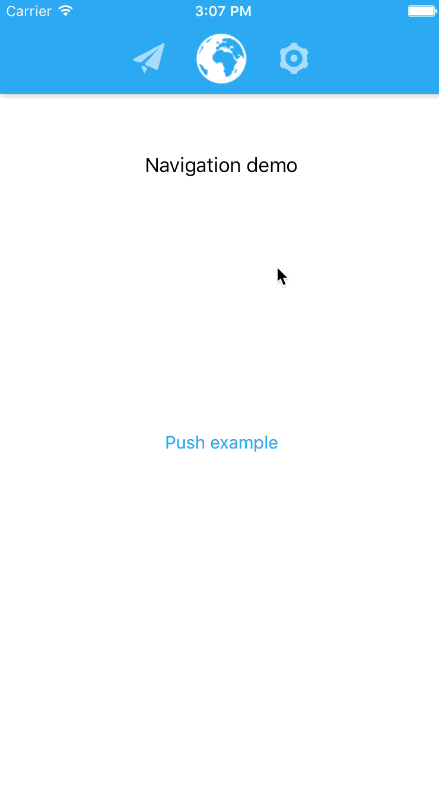

# MIPivotPageController
MIPivotPageController allows switching view controllers with an horizontal swipe



# Setup
- Copy the "MIPivotPageController" folder to your project.
- Create a new instance with just a line of code
```
  MIPivotPageController.get(rootPages: [viewControllerA, viewControllerB, viewControllerC]) 
```

- If you want, you can customize the UI with a simple closure
```

  MIPivotPageController.get(rootPages: [viewControllerA, viewControllerB, viewControllerC])  {
  
    $0.menuView.backgroundColor = myBlueColor
    $0.menuView.layer.shadowColor = UIColor.black.cgColor
    $0.menuView.layer.shadowOpacity = 0.3
    $0.menuView.layer.shadowOffset = CGSize(width: 0, height: 2)
    
    $0.setMenuHeight(60)
  
    $0.setLightStatusBar(true)
  
  }

```

- The root view controllers (in this case viewControllerA, viewControllerB and viewControllerC) must conform the MIPivotRootPage protocol which has only one non-optional method that provide the image for the menu.
```
  func imageForPivotPage() -> UIImage?
```
There're also two usefull method like 
```
  func rootPivotPageDidShow()
  func rootPivotPageWillHide()
```
that are called when a page in showed and when it's about to hide.

- The other view controllers must inherit from MIPivotPage (which inerit from UIViewController).
If you want, you can override those two methods:
```
    func shouldShowPivotMenu() -> Bool { return true }
    func pivotPageShouldHandleNavigation() -> Bool { return true }
```
If the first one return false, the menu will not be visible on that view controller.
If the second one return false, the swipe (to the other root pivot pages) will be disabled for that view controller.

For a better understanding of those methods see the navigationController example in the demo.

# Demo
In this repository you can also find a demo.

# Info
If you like this git you can follow me here or on twitter :) [@MarioIannotta](http://www.twitter.com/marioiannotta)

Cheers from Italy!
